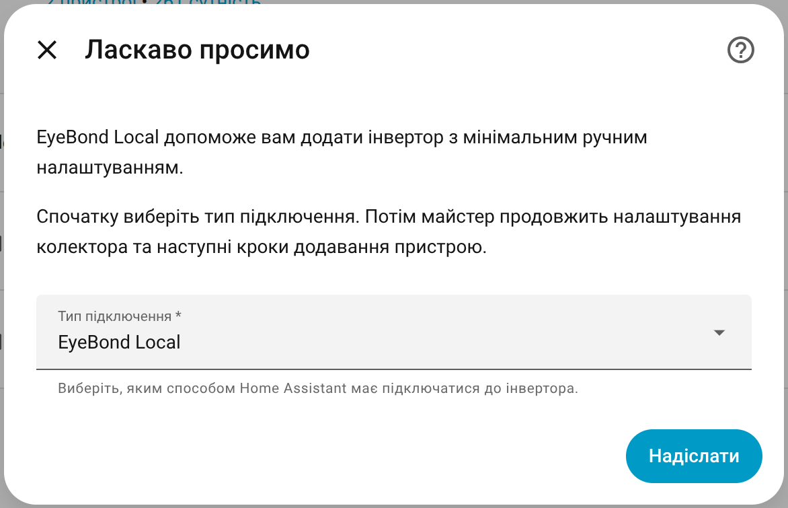
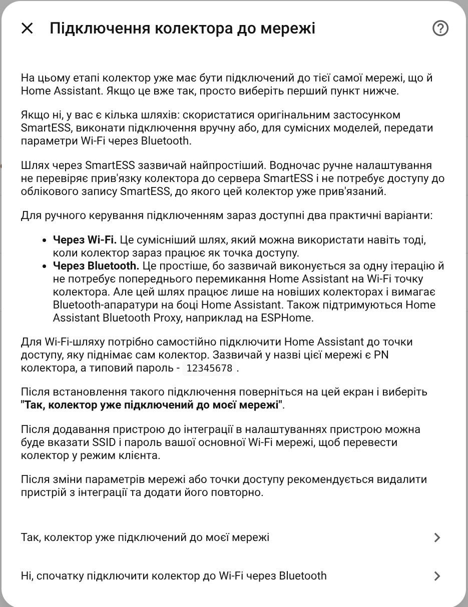
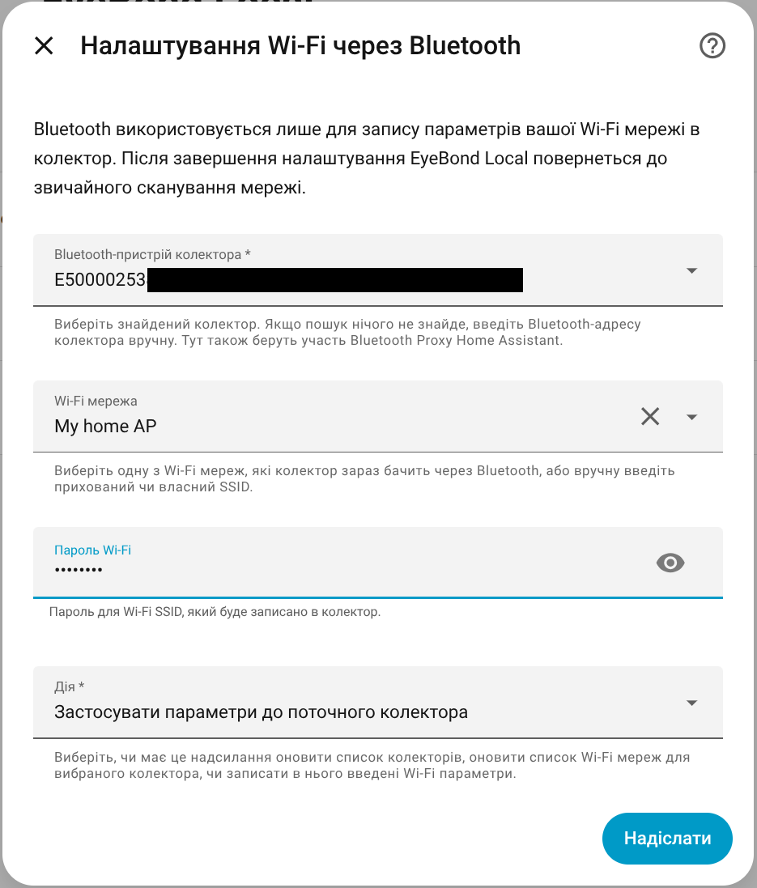
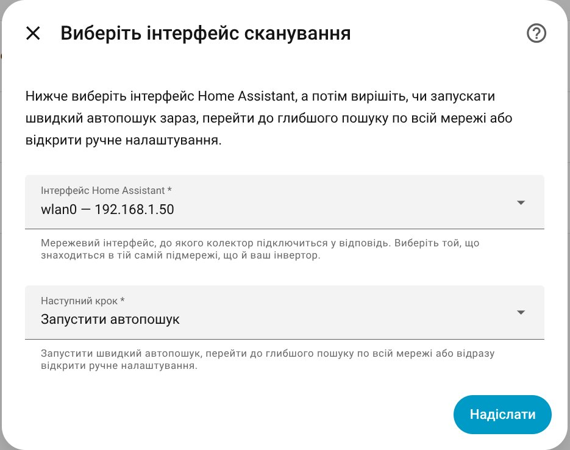
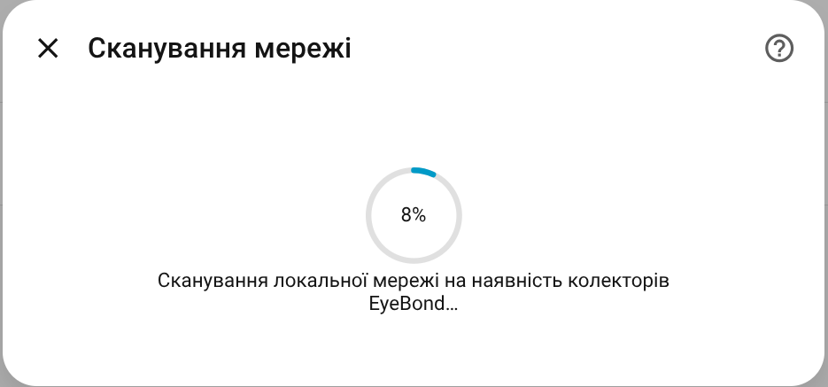
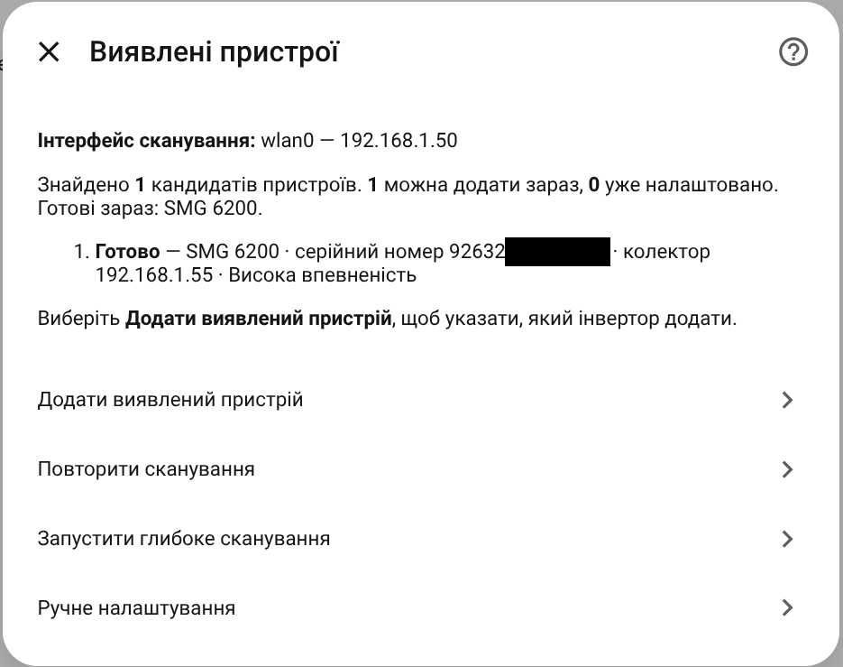
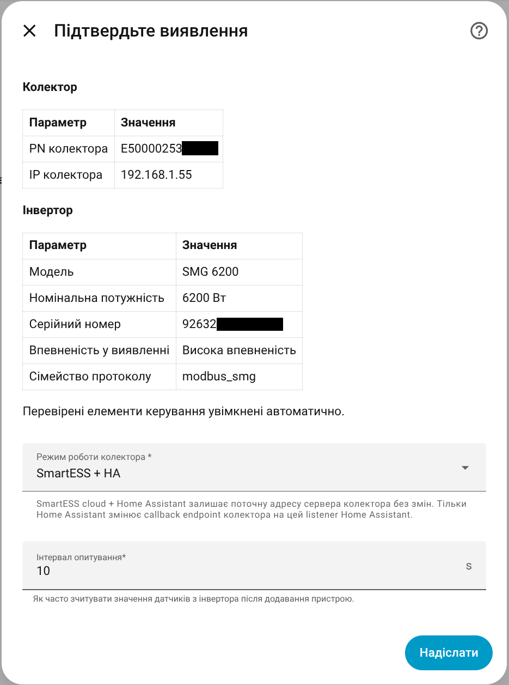
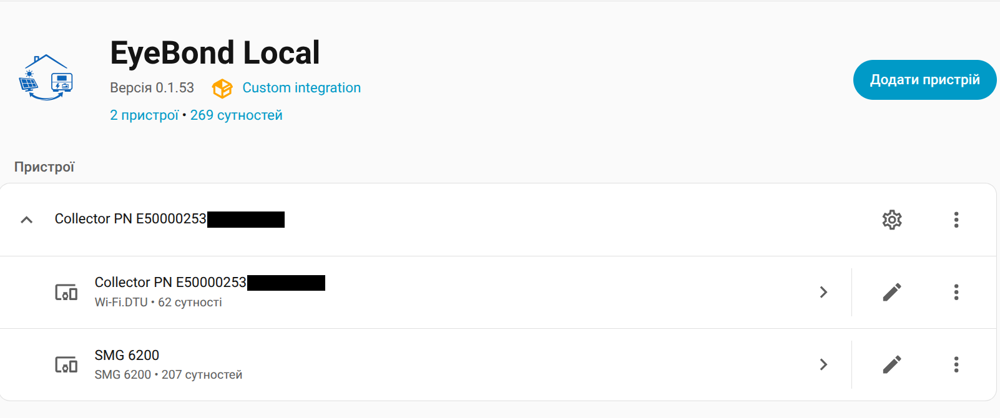
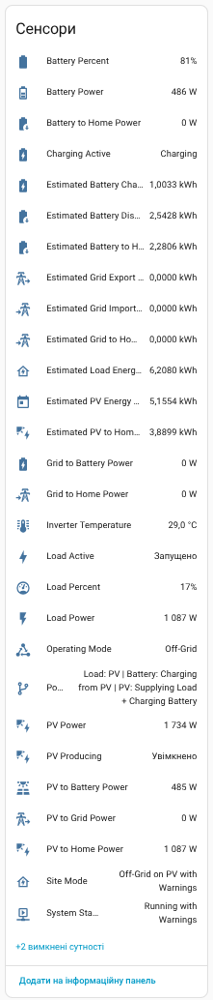
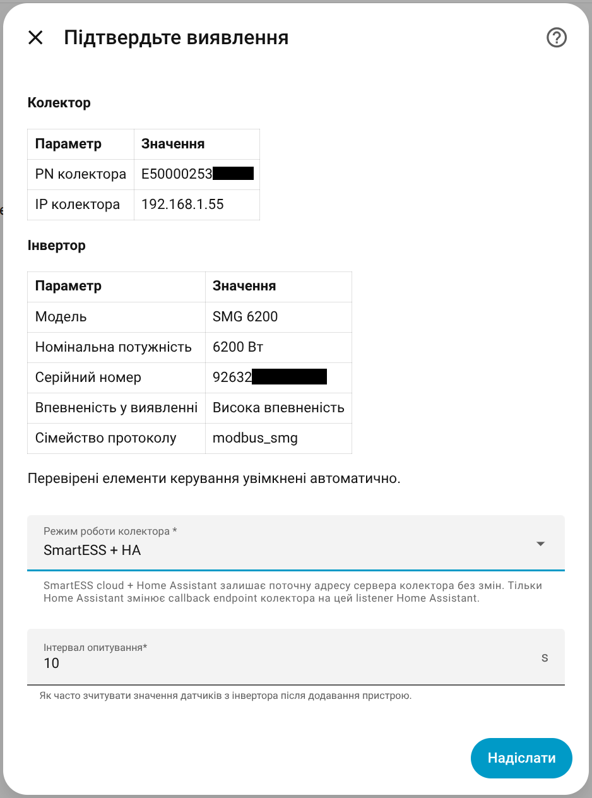

# EyeBond Local

[Українською](README.uk.md)

> **Companion dashboard card:** Pair this integration with [EyeBond Local Card](https://github.com/groove-max/ha-eybond-local-card) for a ready-made Lovelace UI with animated power flow and history charts.

**EyeBond Local** is a Home Assistant integration that talks directly to hybrid inverters connected through SmartESS / EyeBond Wi-Fi collectors.

You get live monitoring, energy totals, and Home Assistant controls for supported inverters over your local network.

For supported collectors, you can keep the normal SmartESS app working alongside Home Assistant with `SmartESS + HA`, or switch the collector to `HA only` if you want that collector to talk only to Home Assistant.

If your inverter's stock monitoring already works through the SmartESS app, that's usually the strongest compatibility signal.

> **Note:** This integration is in active development. Your inverter may need a Support Archive submission so we can confirm compatibility and decide the right next step. See [Supported Hardware](#supported-hardware) and [Getting Help](#getting-help).

---

## Highlights

- **Everyday use stays local** — Home Assistant reads and writes the inverter over your LAN.
- **Guided setup wizard** with quick scan, deep scan, manual fallback, and optional Bluetooth Wi-Fi setup for supported collectors.
- **Two collector modes** — `SmartESS + HA` keeps the vendor app working; `HA only` moves that collector to Home Assistant only.
- **Safe by default** — `Read-only`, `Auto`, and `Full Control` modes let you choose how much write access Home Assistant gets.
- **Separate collector and inverter devices** — collector tools stay in one place, while day-to-day inverter sensors stay in another.
- **Optional SmartESS cloud assist** — reusable cloud evidence for diagnostics and support, not for bypassing local safety gates.
- **Configurable polling interval** — from `2` to `3600` seconds.
- **Energy dashboard ready** — derived totals for PV, load, battery, and, on supported models, grid import/export.

---

## Supported Hardware

EyeBond Local works with inverters whose stock monitoring is available through **SmartESS**. This can be an external **SmartESS / EyeBond Wi-Fi collector** or a built-in Wi-Fi module that speaks the same local protocol.

| Model / hardware class | Status | What it means |
|---|---|---|
| **Sandisolar SD-HYM-4862HWP** | Supported | Full monitoring and tested controls on the verified SMG path. |
| **Anenji ANJ-11KW-48V-WIFI-P** | Supported | Full monitoring, PV1/PV2 telemetry, inverter clock support, and tested controls. |
| **Anenji 4200 (Protocol 1)** | Partial support | Monitoring works, but the write surface still needs broader real-hardware validation. Use `Full Control` only if you understand the risk. |
| **PowMr 4.2kW** (raw model `VMII-NXPW5KW`) | Supported | Full monitoring and tested controls on the verified PI30-family path. |
| **Unknown but clearly SMG-family inverter** | Read-only fallback | Monitoring stays available, but writes remain disabled until the exact model is verified. |
| **PI18-family hardware** | Experimental | Replay-tested only. Useful for research, but not yet public production-ready support. |

For deeper protocol notes and SMG-specific support details, see the [SMG Support Matrix](docs/SMG_SUPPORT_MATRIX.md).

Don't see your inverter? It might still work — open an issue with a [Support Archive](#getting-help) and we can evaluate compatibility and, when the protocol matches, extend support.

---

## Installation

### Via HACS (recommended)

1. Open **HACS → Integrations**.
2. Click the menu (three dots) → **Custom repositories**.
3. Add `https://github.com/groove-max/ha-eybond-local` with category **Integration**.
4. Find **EyeBond Local** in the list and click **Download**.
5. Restart Home Assistant.
6. Go to **Settings → Devices & Services → Add Integration** and search for **EyeBond Local**.

### Manual installation

1. Download the latest release.
2. Copy `custom_components/eybond_local/` into your Home Assistant `config/custom_components/` directory.
3. Restart Home Assistant.
4. Add the integration from **Settings → Devices & Services**.

---

## Setup Walkthrough

The setup wizard now walks you through the collector first, then the inverter.

**1. Welcome** — choose the connection type and start the flow.

**2. Get the collector onto the same network** — if it is already on the same Wi-Fi or LAN as Home Assistant, continue. If not, the wizard explains the practical choices: use the SmartESS app, do it manually, or, on supported collectors, send the Wi-Fi settings over Bluetooth.

If your collector supports Bluetooth provisioning, EyeBond Local can write the Wi-Fi name and password directly, then return to the normal network scan.

**3. Choose how to look for the device** — select the Home Assistant network interface, then start with a quick scan, run a deep scan, or jump straight to manual setup.

**4. Scan the network** — the normal quick scan usually finishes in 5–15 seconds. If it comes back empty, the same flow can retry, switch to deep scan, or open manual setup.

**5. Review detected devices** — you'll see found collectors and inverters with clear statuses:

- **Ready** — confidently detected and safe to add.
- **Review** — found, but EyeBond Local wants you to double-check it.
- **Collector only** — the collector answered, but the inverter model is not fully confirmed yet.

**6. Confirm and choose the collector mode** — review the detected collector and inverter, choose `SmartESS + HA` or `HA only`, then finish the setup.

If quick and deep scan are not practical, **Manual setup** is still available and keeps the same advanced network fields as before. In most homes you can leave those advanced fields untouched and use the default same-LAN path.

> **Tip:** Keep Home Assistant and the collector on the **same subnet** if you want auto-discovery, because broadcast discovery usually does not cross routers.

### SmartESS + HA Or HA Only?

EyeBond Local exposes two everyday collector modes:

- **`SmartESS + HA`** keeps the collector visible in the SmartESS app while Home Assistant also talks to it locally. This is the recommended default for most users.
- **`HA only`** makes that collector reconnect to Home Assistant only. Choose it if you want to stop relying on SmartESS cloud access for that collector.

You can choose the mode during setup and change it later from **Runtime settings** or from the collector device page.

In `SmartESS + HA`, Home Assistant uses its own local connection path. Because of that, the SmartESS app and Home Assistant do not always recover at the same moment after a Wi-Fi connection issue. In some cases the collector may briefly disappear from the local network and from Home Assistant, while the SmartESS app still works. When the Wi-Fi connection becomes stable again, the collector usually comes back on its own after a few minutes.

### Pending Device / EyeBond Setup Pending

If the wizard can save a working collector connection but cannot fully confirm the inverter yet, it can still create a **read-only Pending Device**. In Home Assistant this appears as **EyeBond Setup Pending**.

This is a saved intermediate state, not automatically a failure.

What it means:

- EyeBond Local successfully saved the collector connection.
- The collector may still need to reconnect, or the inverter match may still need to finish.
- Diagnostics and support actions are available immediately, even if the normal sensors are still unavailable.
- The entry can resolve later on its own after the collector reconnects or after you retry the scan or manual probe.

What to do next:

1. Wait a short moment, then refresh the device page. If the collector was just reconfigured, rebooting it can help.
2. On a normal LAN, keep Home Assistant and the collector on the same subnet, then retry quick scan, deep scan, or manual probe.
3. For manual or remote/NAT setups, re-check the collector IP, advertised callback IP and port, and that TCP `8899` / UDP `58899` are not blocked.
4. If the device stays pending, open **Configure → Diagnostics and experimental metadata** and create a **Support Archive** before changing advanced settings.

### Remote / NAT Manual Setup

Most users should leave these advanced fields alone. They are only for remote collectors, VPN links, or port-forwarded / NAT setups.

If Home Assistant and the collector are on the same LAN, keep the default local flow and leave the advertised callback fields empty.

The main fields are:

- **Local listener IP** — the Home Assistant address the collector should reach locally.
- **Collector IP** — the collector address when you already know it and want to probe it directly.
- **Advertised callback IP / TCP port** — only for VPN or forwarded public setups where the collector must call back to a different reachable address.

Need a full walkthrough with examples for VPN and port-forwarding setups? See [Remote / NAT Setup Guide](docs/REMOTE_SETUP.md).

---

## What You Get

After setup, EyeBond Local usually creates **two Home Assistant devices** for one installation:

- **Collector device** — collector IP, signal quality, connected Wi-Fi, collector operation mode, restart, Wi-Fi change, proxy capture, and support actions.
- **Inverter device** — live inverter, PV, battery, and grid sensors plus the supported settings and actions for that hardware.

On the inverter side you get:

- **Sensors** — power, voltage, current, temperature, frequency, operating mode, and other live telemetry exposed by the hardware.
- **Energy totals** — derived `kWh` totals for PV production, load consumption, and battery charge/discharge, plus grid import/export on models that expose grid power.
- **Binary sensors** — charging state, alarms, faults, and other state flags where supported.
- **Supported controls** — `number`, `select`, `switch`, and `button` entities for settings such as charge limits, output mode, beep, and model-specific actions.
- **Polling control** — the sensor refresh interval is configurable from `2` to `3600` seconds.

## Modes And Settings

Two user-facing settings matter most after setup:

- **Collector operation mode** decides whether the collector keeps talking to SmartESS cloud as well as Home Assistant, or whether it talks only to Home Assistant.
- **Control mode** decides how much write access Home Assistant gets on the inverter side.

`Read-only` hides writes, `Auto` enables verified controls automatically when detection confidence is high, and `Full Control` exposes every write command for advanced users who understand the risk.

You can change these later from **Runtime settings**. The collector device page is where network and troubleshooting actions live; the inverter device is where the day-to-day telemetry lives.

---

## SmartESS Cloud Assist

When local detection only reaches a collector-only or low-confidence state, EyeBond Local can optionally query SmartESS cloud for the same collector identity and store reusable cloud evidence JSON under `/config/eybond_local/cloud_evidence/`.

- **Credentials are used only for the live fetch** — the integration does not keep a persistent SmartESS cloud login session.
- **Cloud evidence improves diagnostics and metadata planning** — it does not unlock local write controls by itself.
- **Create support archive can reuse saved evidence automatically** or refresh it inline while the ZIP is being built.
- **Export SmartESS cloud evidence** is the standalone advanced action when you want the evidence itself for review or experimental metadata work.
- **Evidence files stay on disk until you remove them manually**. The latest matching file for the entry is reused automatically.

---

## Getting Help

If something doesn't work, the fastest path is:

1. Open the integration's **Configure → Diagnostics and experimental metadata** screen.
2. Click **Create support archive**.
3. Open a [GitHub issue](https://github.com/groove-max/ha-eybond-local/issues) and attach the generated ZIP.

The Support Archive contains an anonymized snapshot of your inverter's state, register reads, and detection results. When matching SmartESS cloud evidence is already saved, the archive includes it automatically, and the same screen can refresh that evidence inline before the ZIP is written. That's usually enough to understand compatibility and decide the next step. If your device turns out to use a different protocol or a non-standard variant, we may need more evidence or more than one iteration before support can be added.

### Issue templates

- **Bug Report** — for reproducible regressions on already-supported hardware.
- **Support Archive / Hardware Diagnostics** — for unsupported hardware, onboarding failures, and partial support. Always attach the generated ZIP.
- **Feature Request** — for new hardware support or UX improvements.

---

## Troubleshooting

| Problem | Try this |
|---|---|
| Auto-scan finds nothing | Use **Change scan interface** to pick a different network interface first. If the quick scan still comes back empty, try **Run deep scan** from the results screen. If you eventually switch to **Manual setup**, find the Wi-Fi module or collector's local IP address first, usually from your router. |
| Bluetooth Wi-Fi setup is unavailable or unstable | If the Home Assistant host has no local BLE adapter, or the collector is only reachable from nearby, add an **ESPHome Bluetooth Proxy** close to the collector and retry the Bluetooth Wi-Fi setup. |
| Device stays on **EyeBond Setup Pending** | A Pending Device is a saved intermediate state, not a hard failure. Wait briefly, retry scan or manual probe, and then create a Support Archive if the collector callback or local match still does not complete. |
| Stuck on "Collector only" | The collector responded, but the integration still can't confidently identify the protocol, profile, or exact inverter model. Submit a Support Archive. |
| Sensors stay unavailable | Check that the collector is on the same subnet as Home Assistant, and that nothing is blocking TCP `8899` / UDP `58899`. |
| SmartESS app stopped showing live data | Check the collector operation mode. `HA only` disconnects that collector from SmartESS cloud on purpose. Switch back to `SmartESS + HA` if you still want to use the vendor app. |
| SmartESS still works, but Home Assistant says the collector is unavailable | This often means the collector temporarily dropped off the local network after a Wi-Fi interruption. Wait a few minutes, check Wi-Fi stability, and see whether the collector becomes reachable on the LAN again. The SmartESS app can recover sooner than the local Home Assistant connection. |
| A write was accepted but the value immediately reverted | EyeBond Local now treats that as an explicit readback failure instead of silent success. Check the device diagnostics for collector disconnect/restart counters, pause competing SmartESS or vendor-app writes, and retry after the collector is stable. |
| Remote collector replies but never connects back | Check **Advertised callback IP** and **Advertised callback TCP port** first. They must match the address and forwarded TCP port that the collector can really reach. |
| Remote setup is flaky over the public internet | Prefer VPN over raw NAT if either side is behind CGNAT or if UDP/TCP forwarding is unreliable. |
| Controls are missing | In **Auto** mode, controls only appear when detection confidence is high and the relevant capabilities are marked as tested. Some runtime paths are intentionally read-only, such as the SMG family fallback. If monitoring works for a PI30-family inverter but the exact model was not matched, you can open **Runtime settings** and switch to **Full control**. This is a manual safety override that exposes every write command, so use it only at your own risk and preferably after exporting a Support Archive. |

---

## Documentation

- [Documentation index](docs/README.md)
- [Collector management guide](docs/COLLECTOR_MANAGEMENT.md) — collector modes, runtime settings, Wi-Fi change, and everyday collector actions
- [Collector proxy capture guide](docs/PROXY_CAPTURE.md) — what proxy mode is for, how to run it, how the timer works, and how to restore the original server if needed
- [Remote / NAT setup guide](docs/REMOTE_SETUP.md) — when and how to use the new callback override fields
- [SMG support matrix](docs/SMG_SUPPORT_MATRIX.md)
- [Contributing guide](CONTRIBUTING.md)

---

## Repository Layout

A short orientation for people browsing the source. Full developer notes live in [CONTRIBUTING.md](CONTRIBUTING.md).

- `custom_components/eybond_local/` — integration source code
- `custom_components/eybond_local/profiles/` — declarative capability metadata (JSON)
- `custom_components/eybond_local/register_schemas/` — read-side register layouts (JSON)
- `docs/` — public documentation and generated reports
- `.github/` — CI, validation, and release automation
- `.local/` — maintainer-only notes, private utilities, and local release/debug artifacts that are intentionally outside the public user docs surface
- `.local/fixtures/catalog/` — local replay fixtures kept out of git
- `tests/` — unit and regression tests

---

## Validation

Contributor validation and release workflow live in [CONTRIBUTING.md](CONTRIBUTING.md).

---

## License

Licensed under [MPL-2.0](LICENSE) — a deliberate middle ground between permissive and strong-copyleft licenses:

- end users can install, run, fork, and package the integration freely
- if you distribute modified versions of covered files, those file-level changes must remain available under the same license
- friendlier than GPL for Home Assistant users, but less "take and close" than MIT or Apache-2.0
