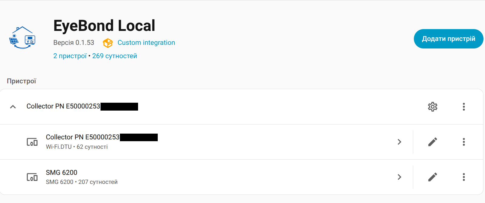

# EyeBond Local SC — Home Assistant integration for the Anenji / Aninerel SMG 6200

Local monitoring and control of a hybrid solar inverter from Home Assistant, over
your LAN, without depending on the vendor cloud.

This is a **personal fork** of
[groove-max/ha-eybond-local](https://github.com/groove-max/ha-eybond-local),
maintained by [Barlows](https://github.com/Barlows) and kept running against one
real unit: an **Anenji / Aninerel SMG 6200** (firmware 7904, dual output) behind a
factory EyeBond Wi-Fi collector. Everything upstream supports is still here. What
this fork adds is the work needed to make that one inverter behave properly, and
the diagnostics used to prove it.

> **Which one should you install?** If you have a different inverter, use
> [upstream](https://github.com/groove-max/ha-eybond-local): it has releases, a
> wider audience and a maintainer who tests other hardware. Use this fork if you
> have an SMG 6200 (or the same family of collector behaviour described below) and
> want the fixes in it.

---

## Why this fork exists

On the SMG 6200 the stock integration worked, but the connection kept falling over.
The collector's session was dropped roughly **every 3.5 minutes**. Home Assistant
logged `collector_disconnected` and re-established the link, so readings had gaps
and every reset was an opportunity for a poll to fail.

The cause turned out to be the dongle itself. Every few minutes it pushes a bare
Modbus RTU read reply (`01 03 <byte count> data CRC`) outside any EyeBond frame, in
rotating sizes. Upstream deliberately treats that as a fault and closes the session.
This fork instead checks the reply's own Modbus CRC and, when it verifies, skips
exactly those bytes and carries on.

Measured on the real unit, comparing before and after:

| | Before | After |
|---|---|---|
| Collector session drops | about every 3.5 minutes | none for 14 h 51 min, then two (a dongle-side TCP reset and a cut-off reply) |
| Stray replies absorbed | each one reset the session | 160 in a single overnight session |

The full story, with the log lines that identified each cause, is in the
[changelog](CHANGELOG.md#2026-10-08-ending-the-collector-reset-cycle). It is
honest about what is not fixed: roughly one failed poll every couple of hours
remains, and the dongle's Wi-Fi occasionally resets the connection on its own.

---

## What is different from upstream

- **Stray Modbus replies are skipped, not fatal.** CRC-verified bare replies are
  absorbed; anything unverifiable, truncated or malformed still closes the session
  as upstream does.
- **Reads retry once** on a wrong slave id or function byte, the signature of a
  stray reply landing in a poll's slot.
- **Diagnostic sensors that tell you the truth** about the collector link:
  - **Collector Retained Disconnect Reason** — why the last session closed; it
    genuinely survives the reconnect now (the first version of this sensor, added
    here on 2026-09-25, did not).
  - **Collector Last Disconnect Reason** — the same for the current session; reads
    `none` when healthy.
  - **Collector Stray Modbus Replies Skipped** — how many the current session has
    absorbed.
  - **Collector Callback Wire Framing**, **Collector Management Adapter** and
    **Observed Session Protocol**, for transport faults.
- **Raw-byte logging of rejected reads**, so a failure is explained by what
  arrived rather than by an error code.
- **SMG 6200 firmware 7904 catalog entry** (`smg_6200_fw7904`), the
  **Solar-Utility-FeedIn** output-source-priority option, an **Output 2 Overload**
  fault code, and hardware-tested notes for `automatic_mains_output_enabled`,
  `output2_cutoff_soc` and `output2_overload_threshold`.
- **No periodic Wi-Fi scan query** to the collector, which made its radio leave its
  channel on every metadata cycle.
- A test suite that can actually be run to completion, with the harness leaks that
  made it misleading fixed.

Nothing here has been tested on other hardware by this fork. Support for other
inverters is inherited from upstream as-is.

---

## Install

This fork has **no tagged releases**. HACS follows the latest commit on `main`, and
the version it shows is that commit's short hash.

### HACS

1. Open **HACS → Integrations**.
2. Menu → **Custom repositories**.
3. Add `https://github.com/Barlows/ha-anenji-6200` as an **Integration**.
4. Find **EyeBond Local SC** and click **Download**.
5. **Restart Home Assistant.** Reloading the integration is not enough after the
   Python files change.
6. Go to **Settings → Devices & Services → Add Integration** and search for
   **EyeBond Local SC**.

To update later, use HACS as usual and restart. The commit hash HACS shows should
match the latest entry in the [changelog](CHANGELOG.md).

### Manual

1. Download the [`main` branch archive](https://github.com/Barlows/ha-anenji-6200/archive/refs/heads/main.zip).
2. Copy `custom_components/eybond_local/` into `config/custom_components/`.
3. Restart Home Assistant and add **EyeBond Local** from **Settings → Devices &
   Services**.

Keep backup copies **outside** `config/custom_components/`. Renaming an old copy to
`eybond_local_backup` inside that directory does not disable it: Home Assistant can
discover its unchanged manifest and load the old code. Leave only the intended
`eybond_local/` copy there.

### Testing the unreleased `main` branch

Because there are no releases, `main` *is* the build. Install it as above. If you
are trying a specific change that has not been merged, replace the whole
`config/custom_components/eybond_local/` directory with the one from that branch's
archive (do not mix files from two builds) and restart.

When reporting a result, include the commit hash and a fresh
[Support Archive](docs/user/SUPPORT_ARCHIVE.md).

---

## Setting it up

The wizard adds the collector first; the inverter is identified afterwards on the
owned session and its entities appear shortly after. The collector and Home
Assistant need to be on the same network.

1. **Put the collector on your LAN** (vendor app, manual Wi-Fi setup, or Bluetooth
   Wi-Fi setup if the collector supports it).
2. **Scan.** Choose the Home Assistant network interface and start a scan. If it
   finds nothing, retry, pick another interface, or enter the collector's address
   through advanced setup.
3. **Review and confirm** the candidate ("Ready to set up", "Needs confirmation" or
   "Check address"), then choose the refresh mode.

The detailed walkthrough, including background discovery and manual and remote
setup, is in [Setup and Discovery](docs/user/SETUP_AND_DISCOVERY.md) and the
[Remote / NAT guide](docs/user/REMOTE_SETUP.md).

### What you get

Two Home Assistant devices: the **collector** (Wi-Fi signal, connection settings,
restart, support archive, and the link diagnostics above) and the **inverter** (PV,
battery, load and grid sensors, energy totals for the Energy dashboard, alarms,
and the controls your exact model supports).

Control access is your choice: **Read-only**, **Auto** (verified controls on a
confident match) or **Full Control** (advanced). Sensor refresh is **Automatic** or
a fixed **Manual** interval from 2 to 3600 seconds; see
[Runtime Detection and Entities](docs/user/RUNTIME_AND_INVERTER.md).

---

## Reading the link diagnostics

The collector link on this unit is the part that needed work, so it is also the part
with the most instrumentation. A healthy system looks like this:

- **Collector Retained Disconnect Reason** reads `none`, or an old reason that does
  not change.
- **Collector Stray Modbus Replies Skipped** counts up steadily and only falls
  back to 0 when a new session starts.
- The log has no `Closing collector session` warnings.

When something closes the session, the retained reason says why:

| Retained reason | Meaning |
|---|---|
| `collector_connection_reset` | The TCP connection was reset. Network or dongle side, often Wi-Fi related. |
| `collector_frame_payload_timeout` | A frame or stray reply started but never finished, typically a Wi-Fi hiccup mid-transfer. |
| `collector_frame_header_timeout` | A frame header never completed. |
| `collector_frame_length_invalid` / `collector_frame_function_invalid` | Bytes that failed header validation and did not verify as a Modbus reply. Likely wire corruption. |

### Warnings you can ignore

- `Updating state for number.… took 0.7 seconds` — slow, harmless, and not a bug in
  this fork. (The link it prints points at upstream's issue tracker.)
- An occasional `Runtime refresh failed: unexpected_slave_id:0` or
  `unexpected_function:0` — one poll lost to a stray reply, retried once, and the
  next poll succeeds. The new `Modbus read answer rejected: … bytes=…` line shows
  exactly what arrived if you want to look closer.

---

## Getting help

If the integration does not work as expected:

1. Open the integration in **Settings → Devices & Services**.
2. Click **Configure → Diagnostics and service tools**.
3. Click **Create support archive**.
4. Open a [GitHub issue on this fork](https://github.com/Barlows/ha-anenji-6200/issues)
   and attach the ZIP.

For an SMG 6200 problem, also say what **Collector Retained Disconnect Reason**
shows and paste any `Modbus read answer rejected` or `Closing collector session`
log lines. For other hardware you will probably get faster help from
[upstream](https://github.com/groove-max/ha-eybond-local/issues).

Details of the archive are in [Support Archive](docs/user/SUPPORT_ARCHIVE.md).

---

## Troubleshooting

| Problem | Try this |
|---|---|
| Auto-scan finds nothing | Retry or choose a different Home Assistant interface. See [Setup and Discovery](docs/user/SETUP_AND_DISCOVERY.md) and use advanced setup with a known collector address. |
| Bluetooth Wi-Fi setup unavailable | Give Home Assistant Bluetooth access near the collector; an ESPHome Bluetooth Proxy can help. |
| Only the collector device appears | The inverter has not been identified yet. Check **Poll Context** and [Runtime Detection and Entities](docs/user/RUNTIME_AND_INVERTER.md); create a Support Archive if no driver binds. |
| Sensors stay unavailable | Check that the collector and Home Assistant share a network and the collector has stable Wi-Fi. |
| Repeated `collector_disconnected` | Read **Collector Retained Disconnect Reason** (table above). Resets that fit `collector_connection_reset` or a payload timeout point at Wi-Fi. |
| Vendor app stopped showing live data | **Home Assistant only** disconnects the cloud on purpose. With **Cloud + Home Assistant**, see the [known cloud telemetry issue](#known-cloud-telemetry-issue). |
| A setting changes back immediately | The inverter rejected or did not confirm the value. Avoid changing it from the vendor app at the same time and retry once the collector is stable. |
| Controls are missing | Keep **Auto** mode; if monitoring works but controls are missing, run device learning if offered or create a Support Archive. Use **Full Control** only if you understand the risk. |
| Remote setup needed | Use the [Remote / NAT guide](docs/user/REMOTE_SETUP.md). Prefer a VPN over public port forwarding. |

### Known cloud telemetry issue

Some users report that, in **Cloud + Home Assistant**, the vendor app stops updating
or shows the collector offline while local Home Assistant readings continue. Cloud
updates may return on their own. This is an upstream issue under investigation; its
cause and a general fix are not confirmed, and this fork has not looked into it.

It is different from **Home Assistant only**, where cloud disconnection is
intentional. If it happens, create a [Support Archive](docs/user/SUPPORT_ARCHIVE.md)
during the outage, before restarting, and add it to
[upstream issue #13](https://github.com/groove-max/ha-eybond-local/issues/13) with
the installed version or commit, when it started, your time zone and the cloud's
last data timestamp.

---

## Also in the box (from upstream)

Everything below is upstream functionality that this fork carries unchanged:

- **Device learning** — read-only cloud evidence or verified extra controls for a
  partially supported device: [Device Learning](docs/user/DEVICE_LEARNING.md).
- **Collector management** — Wi-Fi, restart, UART and server-endpoint settings:
  [Collector Management](docs/user/COLLECTOR_MANAGEMENT.md).
- **Support Archive, diagnostic commands and proxy capture** for hard cases.
- **Companion dashboard card** — [EyeBond Local Card](https://github.com/groove-max/ha-eybond-local-card).
- **No factory collector?** The community
  [ESP EyeBond Collector](https://github.com/groove-max/esp-eybond-collector) is an
  ESP8266/ESP32 bridge that talks to this integration locally.
- Support for many other brands on EyeBond-compatible collectors (PowMr,
  Sandisolar, LVYUAN, MUST, Yingfa, SRNE, PI18 and PI30 families and more); see the
  [inverter model catalog](docs/generated/INVERTER_MODEL_CATALOG.generated.md).

---

## Documentation

- [Documentation index](docs/README.md)
- [Setup and discovery](docs/user/SETUP_AND_DISCOVERY.md)
- [Runtime detection and entities](docs/user/RUNTIME_AND_INVERTER.md)
- [Kevolt / Deye-compatible advanced controls](docs/user/KEVOLT_DEYE_CONTROLS.md) — experimental opt-in settings for the documented 80 kW register map
- [Collector management](docs/user/COLLECTOR_MANAGEMENT.md)
- [Device learning](docs/user/DEVICE_LEARNING.md)
- [Diagnostic commands](docs/user/DIAGNOSTIC_COMMANDS.md) — advanced, developer-directed scenarios
- [Support Archive](docs/user/SUPPORT_ARCHIVE.md)
- [Remote / NAT setup](docs/user/REMOTE_SETUP.md)
- [Proxy capture](docs/user/PROXY_CAPTURE.md) — use only when asked during support
- [Inverter model catalog](docs/generated/INVERTER_MODEL_CATALOG.generated.md)
- [Interface screenshots by version](docs/user/INTERFACE_SCREENSHOTS.md)
- [Changelog (this fork)](CHANGELOG.md) and [upstream changelog](UPSTREAM_CHANGELOG.md)
- [Contributing](CONTRIBUTING.md)

---

## Working on this fork

- **Tests.** `pip install -r requirements-test.txt`, then
  `python -m unittest discover -s tests -p "test_*.py"` (about four minutes). The
  two libraries in the requirements file are not optional: leaving them out gives a
  confusing spread of order-dependent failures rather than a clean error.
- **Changes** come in as pull requests against `main`, each with a changelog entry
  that names the PR and commit.
- **Upstream.** Upstream changes are pulled in deliberately, not automatically.
  Its changelog goes into [UPSTREAM_CHANGELOG.md](UPSTREAM_CHANGELOG.md); this fork's
  own changes stay in [CHANGELOG.md](CHANGELOG.md).
- **Deliberately not done:** broad refactors. PR #9 was reviewed and closed unmerged;
  the aim is to keep one inverter stable rather than to track upstream's
  architecture. Its integration attempt is kept on the `integrate-pr9` branch.

## Credit and licence

All of the underlying integration is the work of
[groove-max and the upstream contributors](https://github.com/groove-max/ha-eybond-local/graphs/contributors);
this fork's changes are small by comparison. Licensed under [MPL-2.0](LICENSE), the
same as upstream.
