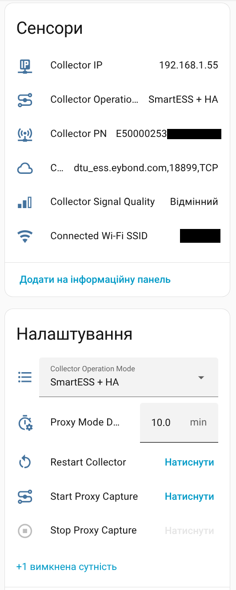
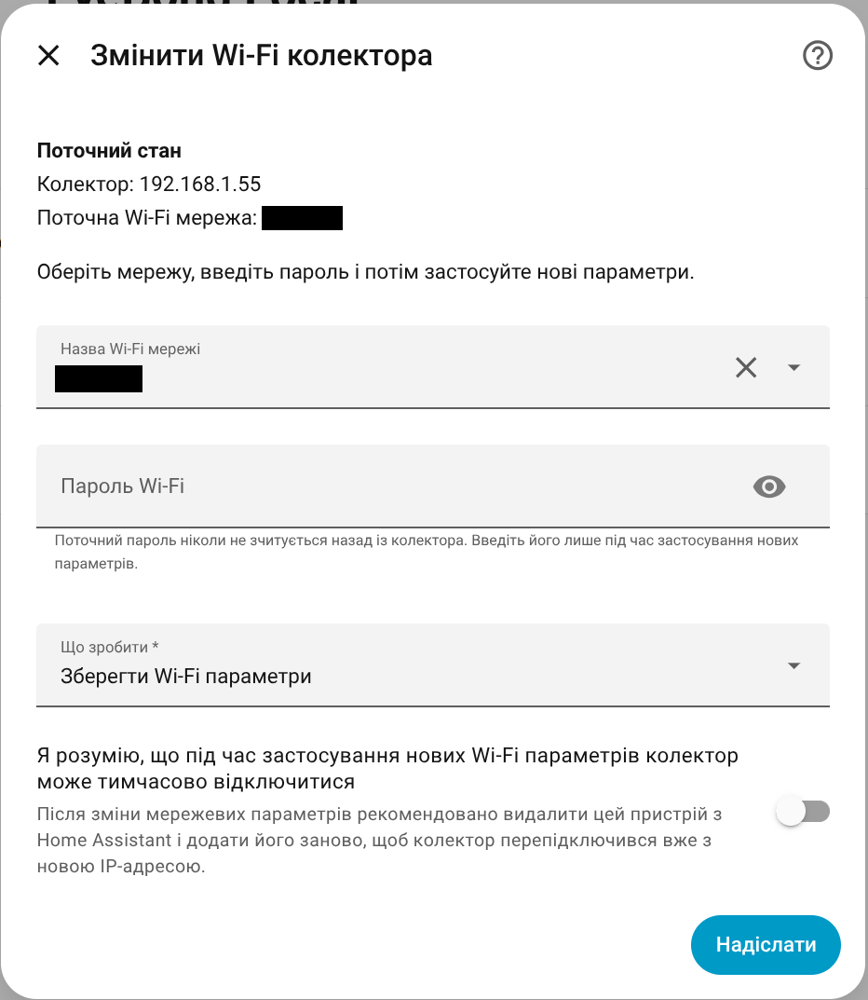

# Collector Management

This guide explains the collector side of EyeBond Local in plain terms: what the collector device is for, which mode to choose, and which collector actions are meant for everyday use.

## Collector And Inverter Devices

EyeBond Local usually creates two devices in Home Assistant for one installation:

- the **collector device**, which holds network, connection, and troubleshooting actions
- the **inverter device**, which holds the live power, battery, PV, and control entities you use day to day

If you are looking for Wi-Fi, reconnect, proxy capture, or collector mode settings, start with the collector device.

## Collector Operation Mode

The most important collector setting is **Collector Operation Mode**.

### `SmartESS + HA`

Choose this when you still want to use the SmartESS app.

- the collector stays visible to SmartESS
- Home Assistant still talks to the inverter locally
- this is the recommended default for most users

### `HA only`

Choose this when you want that collector to talk only to Home Assistant.

- the collector reconnects to Home Assistant only
- the SmartESS app will no longer show live data for that collector while this mode is active
- this is the right choice when you want a fully local day-to-day setup

You can choose the mode during setup and change it later from **Runtime settings**.

## Control Mode Is A Different Setting

Do not confuse **Collector Operation Mode** with **Control Mode**.

- **Collector Operation Mode** decides whether the collector keeps SmartESS cloud access or talks only to Home Assistant.
- **Control Mode** decides how much write access Home Assistant gets on the inverter side.

The control modes are:

- **`Read-only`** — monitoring only
- **`Auto`** — verified controls appear automatically when detection confidence is high
- **`Full Control`** — every available write command is exposed for advanced users who understand the risk

For most people, `SmartESS + HA` plus `Auto` is the safest normal setup.

## Everyday Collector Actions

The collector device can expose a few practical actions.

### Change Collector Wi-Fi

Use this when the collector must join a different SSID or when you are moving it to another router or access point.

- enter the new SSID and password
- apply the new settings
- expect the collector to reconnect, sometimes on a new IP address

After a Wi-Fi change, re-adding the device can be the easiest way to pick up the new collector IP cleanly.

### Restart Collector

Use this after changing collector networking, or when the collector stopped responding and you want a quick reconnect without power-cycling hardware.

### Start Proxy Capture

This is a troubleshooting tool. Most users do not need it for normal operation.

Use it only when you are collecting extra evidence for diagnostics, support, or bug reports.

For the full user guide, see [Collector Proxy Capture](PROXY_CAPTURE.md).

## When You Need Advanced Networking

If Home Assistant and the collector are on the same LAN, you usually do not need any advanced networking options.

If the collector is remote, behind another router, or must call back through VPN or port forwarding, read the [Remote / NAT Setup Guide](REMOTE_SETUP.md).

## Need Help?

If something still does not look right:

1. Open the integration's **Configure** menu.
2. Create a **Support Archive**.
3. Attach the ZIP to a GitHub issue.

That usually gives enough information to understand whether the problem is setup, networking, or model compatibility.