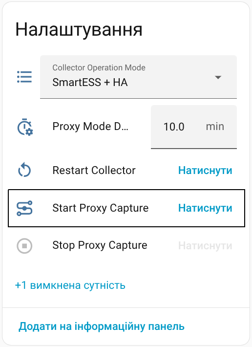
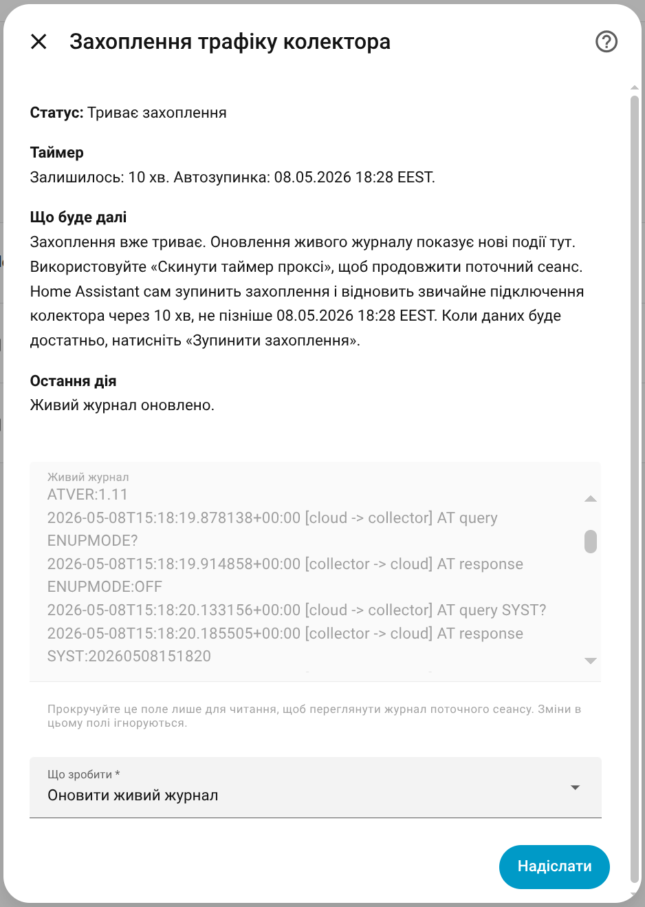
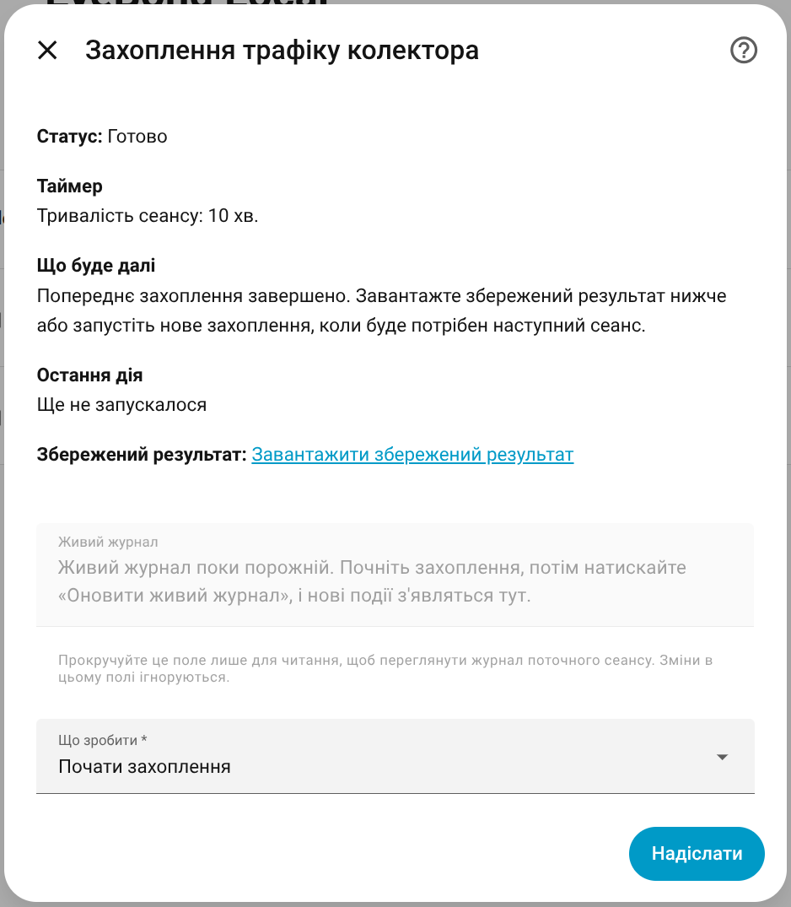

# Collector Proxy Capture

This guide explains EyeBond Local proxy mode from a user point of view: why you would use it, how to start it, how the timer works, what the saved result contains, and what to do if the collector does not restore its original server afterward.

## What Proxy Mode Is For

Proxy mode is a diagnostic tool for the collector connection path.

Use it when you need to understand what the collector is sending and receiving during its cloud-facing session, or when you want extra evidence for troubleshooting, support, or protocol research.

For normal day-to-day monitoring, most users do not need proxy mode.

## What Happens During A Proxy Session

When proxy mode starts, Home Assistant begins accepting the collector traffic for a temporary capture session.

If the collector is still pointing at its original external server, EyeBond Local temporarily switches that callback to Home Assistant, records the traffic, and then restores the original callback when the session ends.

If the collector is already using a Home Assistant-owned callback path, the session can start without that temporary server change.

The important practical idea is simple:

- proxy mode is temporary
- the original upstream path is meant to be restored afterward
- the saved result is separate from the normal Support Archive flow

## Before You Start

Proxy mode works best when:

- the collector is connected and stable on the network
- Home Assistant can already communicate with it reliably
- the collector has a known upstream callback endpoint that EyeBond Local can restore later

If the collector needs a temporary callback redirect for the session, the current control policy must allow collector-side changes. In practice, that usually means using `Auto` or `Full Control` while you run the capture.

## How To Start Proxy Mode

You can start it from two places.

### Option 1. Collector Settings On The Device Page

Open the collector device in Home Assistant and use the collector-side entities there.

The main items are:

- **Collector Operation Mode** — normal collector ownership mode, not the proxy action itself
- **Proxy Mode Duration** — the session length in minutes
- **Start Traffic Capture** — starts the session
- **Stop Traffic Capture** — stops the session early
- **Restore SmartESS Access** — restores the remembered original server if a previous redirect was not fully rolled back

This is the quickest path when you already know you want to start a capture and you only need the duration field plus the start and stop buttons.

### Option 2. Collector Configuration Menu

Open:

1. **Settings -> Devices & Services**
2. Open the EyeBond Local entry
3. Choose **Configure**
4. Open **Diagnostics and service tools**
5. Open **Advanced metadata tools**
6. Choose **Collector traffic capture**

That screen is better when you want to watch the live session, refresh the log, or download the saved result right after the capture ends.

## What The Proxy Capture Menu Actions Do

The capture screen can show these actions in the **What to do** menu:

- **Start proxy capture** — starts a new capture session
- **Refresh live log** — reloads the visible session log without changing the timer
- **Stop proxy capture** — stops the session and finalizes the saved result
- **Reset proxy timer** — extends the running session back to the full configured duration

While the session is running, the live log view shows decoded events from the current capture.

## How The Proxy Timer Works

EyeBond Local treats proxy capture as a leased session.

### The Base Duration

The **Proxy Mode Duration** number in collector settings is the base session length in minutes.

When you start a new capture, EyeBond Local uses that value to calculate the auto-stop deadline.

### Automatic Stop

When the timer runs out, Home Assistant stops the capture automatically and then tries to restore the normal collector path.

This is the safe default so a forgotten capture does not keep the collector in proxy mode indefinitely.

### Manual Extension

You can extend a running session in two ways:

1. In the **Collector traffic capture** screen, choose **Reset proxy timer**. This resets the countdown back to the full configured duration.
2. Change the **Proxy Mode Duration** number while the session is still active. The new value is applied immediately as the new deadline for the running session.

### What Does Not Extend The Session

Refreshing the live log does **not** extend the timer. It only reloads the visible session output.

## What You Get At The End

After you stop the session, or after Home Assistant stops it automatically, the same capture screen shows a **Saved result** download link.

The saved result is a standalone ZIP bundle for that one proxy session.

It contains:

- a manifest with session metadata and restore status
- the captured proxy trace in JSONL form
- directional raw transport dumps for collector-to-server and server-to-collector traffic

By default, the exported trace is anonymized for sharing.

This saved result is separate from the normal **Support Archive**. If you also need the broader developer package with runtime metadata, raw capture, replay fixtures, and optional SmartESS cloud evidence, run **Create support archive** separately.

## When Restore Does Not Fully Happen

In the normal path, stopping proxy mode restores the remembered original callback server automatically.

In rare cases that restore may not finish cleanly. Typical examples are:

- Home Assistant restarting during the session
- the collector rebooting at the wrong moment
- a network interruption while the callback is being switched back

The most obvious symptom is that the collector keeps pointing at the local Home Assistant callback when it should have returned to the original SmartESS-facing path.

## How To Restore The Original Server

If that happens, open the collector device page and use **Restore SmartESS access**.

That action tells EyeBond Local to put back the remembered original callback endpoint captured before the redirect.

Use this sequence:

1. Open the collector device
2. Find **Restore SmartESS access**
3. Run it once
4. Give the collector a moment to reconnect normally
5. Check whether the SmartESS app and the normal collector path return

If the restore action is unavailable, EyeBond Local does not yet have a cached original endpoint for that collector. In that case, avoid repeated proxy retries until the collector is back in a known-good normal state.

## When To Use Proxy Mode Vs Support Archive

Use **Proxy mode** when you need one focused transport capture for the collector session itself.

Use **Create support archive** when you need the broader developer package for a bug report or support request.

They are complementary tools, not duplicates.